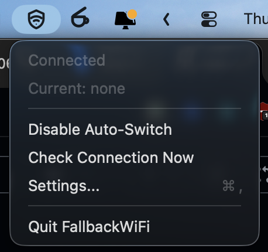
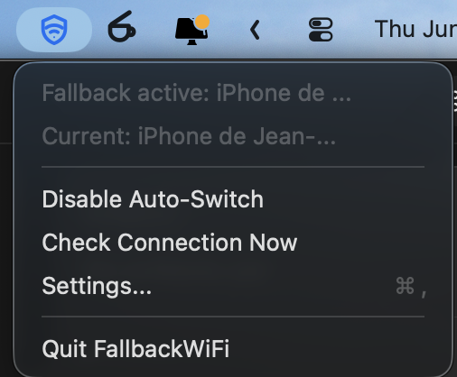
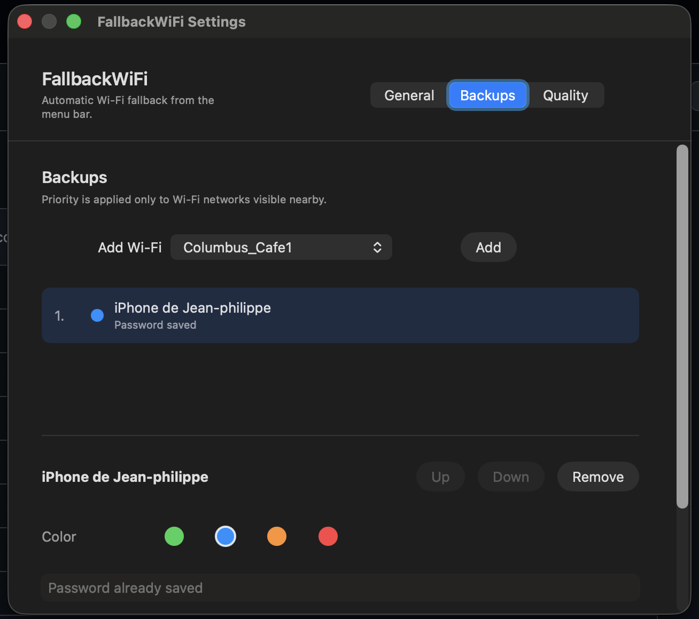

# FallbackWiFi

<p align="center">
  
</p>

Tiny macOS menu bar app that switches to a selected backup Wi-Fi when the current connection loses internet access.

<p>
  
</p>

## MVP

- Manage a prioritized list of backup Wi-Fi networks.
- Skip backup Wi-Fi networks that are not visible nearby before attempting to join.
- Save the backup Wi-Fi password once in the app's Keychain item.
- Assign a distinct menu bar active color to each backup Wi-Fi.
- Optionally switch when ping/download quality falls below configured thresholds.
- Keep the menu bar icon monochrome during normal use.
- Tint the selected shield/Wi-Fi icon when fallback is active.
- Configure the fallback active color in Settings.
- Run periodic connection checks and manually test from the menu.

## Screenshots

### Menu bar

FallbackWiFi lives in the macOS menu bar and keeps the icon stable during background connection checks.

<p>
  
</p>

When fallback is active, the menu bar icon uses the configured backup color.

<p>
  
</p>

The menu also shows the active fallback network while keeping the quick actions easy to reach.

<p>
  
</p>

### Backup settings

Backups can be prioritized, assigned per-network colors, and configured with a saved Keychain password.

<p>
  
</p>

## Development

```sh
swift test
swift build -c release
./script/build_and_run.sh --verify
```

The bundled app is created by:

```sh
make all
```
